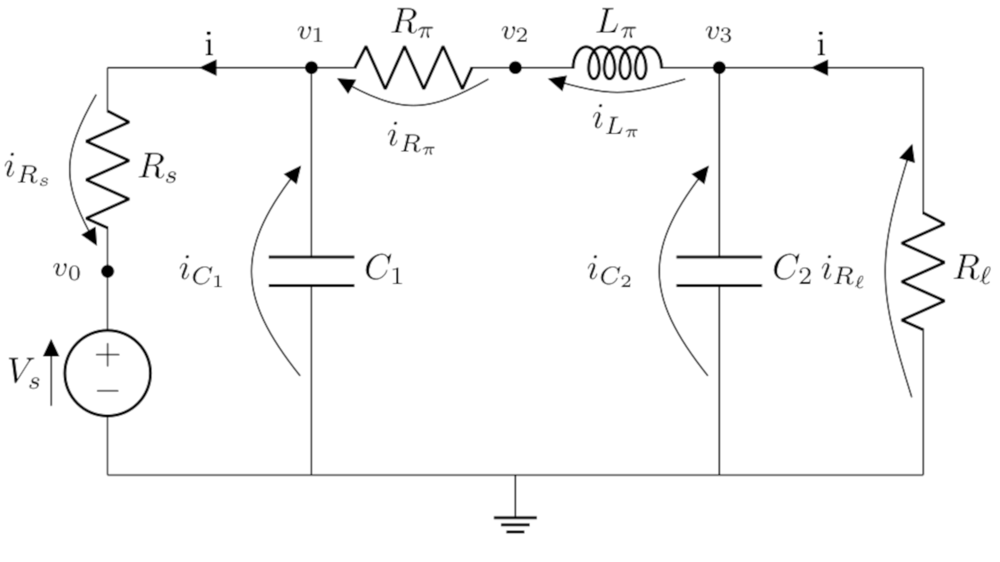
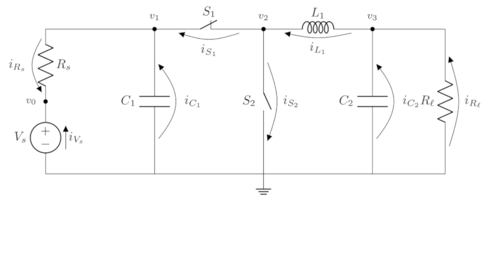
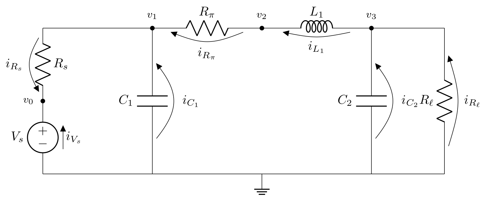
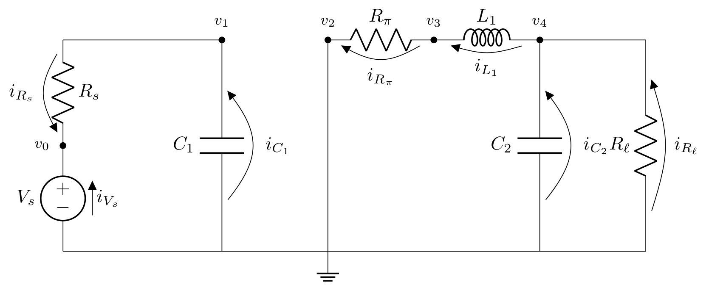
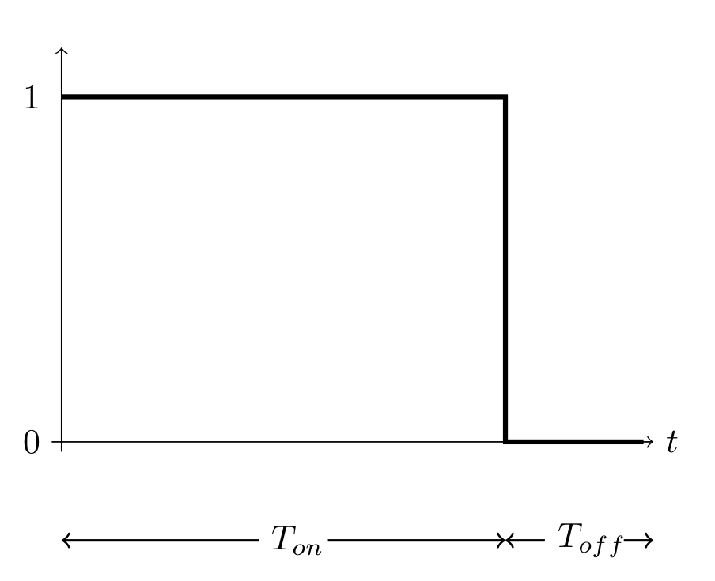

# Tutorial

## 1. Basics
Before we dive in to the complex world of power systems, some theory about electrical circuits has to be looked at and explained. Relations between current and voltage for circuit elements provide the fundamentals for a derivation of a system of ordinary differential equations (ODE). Furthermore, _Kirchhoff's laws_ are needed to describe the connections of currents and voltages in a circuit. 

### 1.1 Relation between current and voltage
This subsection deals with the relation between current and voltages of an object. It illustrates the basis for the modelling. One of the relation is _Ohm's law_, which states that the relation between current and voltage in an object is described by

  

  
where  is the measured voltage across the object (in volts),  is the current flowing through the object (in amperes) and  describes the resistance (measured in ohms). For circuit elements, this relation is applied for resistors.

Another important relations are those for capacitors and inductors. First, the relation between current and voltage through a capacitor is given by

  

where the voltage and the current are assumend to be time-dependent on time  and  ist the capacitance of the capacitor. For the last circuit element that is considered, the relation is also using a derivative with respect to time :

  

where  is the inductance of the inductor.

### 1.2 Kirchhoff's laws 

There are two laws formulated by Gustav Kirchhoff. The first law, the _current law_, states that the sum of currents flowing in a node is equal to the sum of currents flowing out of a node. Another equivalent formulation of this law is that the sum of all currents that come together at a node is zero:

  

The _voltage law_, which is the second of Kirchhoff's laws states that the sum of the voltages in a closed loop is zero:

  

## 2. Components of a DC Microgrid
In the second chapter of the tutorial, the DC microgrid will be explained and an ODE system for each component will be derived for a simulation. In order to understand how a DC microgrid works, we take a look to their construction. The main components are a _DC/DC converter_ and the _Pi-model transmission line_ (shortly: _Pi-model line_). 

### 2.1 Pi-model transmission line

  

The Pi-model line serves as a connection between each power component in the microgrid. The circuit describing the Pi-model line can be seen above and consists of two capacitors, two resistors and an inductor. Here, a voltage source is also added. Later, this circuit is connected to other ODEs describing _DC/DC converters_ and source of voltage will be provided by a battery. 

In a simulation, the interesting values are the voltages of the capacitors and the current of the inductor. These values namely have a relation containing a derivative. For a construction of an ODE system to simulate the Pi-model line, the _Kirchhoff's laws_ provides important regularities in an electrical circuit. The Pi-line satisfies the following:

**Kirchhoff's current law**:
- for node : 
- for node : 
- for node : 
- for node : 

**Kirchhoff's voltage law**:
1. 
2. 
3. 

Then, the ODE system for modelling the Pi-model line is of the form   with:

  

and
  

    
  

the vector of unknown values containing the voltage of the first and second capacitor  and  and the current on the inductor .

  
### 2.2 Buck (step-down) converter

  

The figure above shows a simplification of a buck (step-down) converter. The buck converter converts a large input voltage in a smaller output voltage by comparing the output voltage with a predefined target output voltage. When both voltages are equal, then switches will be switch over. Note that both switches are always in opposite state to each other. In order to explain the modelling for the buck converter, first the buck converter is assumed to be in _first state_, which means the switch  is open and the second switch  is closed. This results in the circuit:

  

Note that this circuit corresponds to the Pi-model line. Then, to model this electrical circuit, the _Kirchhoff's laws_ are used. They are:

**Kirchhoff's current law**:
- for node : 
- for node : 
- for node : 
- for node : 
    
**Kirchhoff's voltage law**:
1. 
2. 
3. 

As in the case of the Pi-model line, the ODE system of the first state of the buck converter has the form  with coefficient matrix and right-hand side:

  

and solution vector

    
  

Switching to the second state means that the switches have the states  and , which yields the circuit:

  

Modelling requires the both laws:

**Kirchhoff's current law**:
- for node : 
- for node : 
- for node : 
- for node : 
- for node : 

**Kirchhoff's voltage law**:
1. 
2. 
3. 

Finally, the ODE system is also of the form  with coefficient matrix and right-hand side:

  

and the vector of unknowns
  

    
  

## 3. Control
In the last section about the buck converter, the circuit can be in two different states. A few questions arise: Which state is the current state? When does the converter switch to the other state? In order to answer these questions and learn a little bit more about the functionality of a DC microgrid, this section deals with the controlling of the output voltage. Remember that the buck converter reduces the input voltage. Moreover, it can reduce the input voltage to a target output voltage. The controller can realise this via comparing the actual output voltage with a desired output value in every time step.

### 3.1 Duty cycle
The duty cycle specifies the relation between the ON-time and OFF-time of a switch. It is defined as a percentage or as relative value. Then, a duty cycle of 0.75 (or 75 %) means that the ON-time in a period accounts for 75% of the time. In ths 75% the switch is closed. In the other 25 %, the switch is closed. This process is illustrated in the picture:

  

