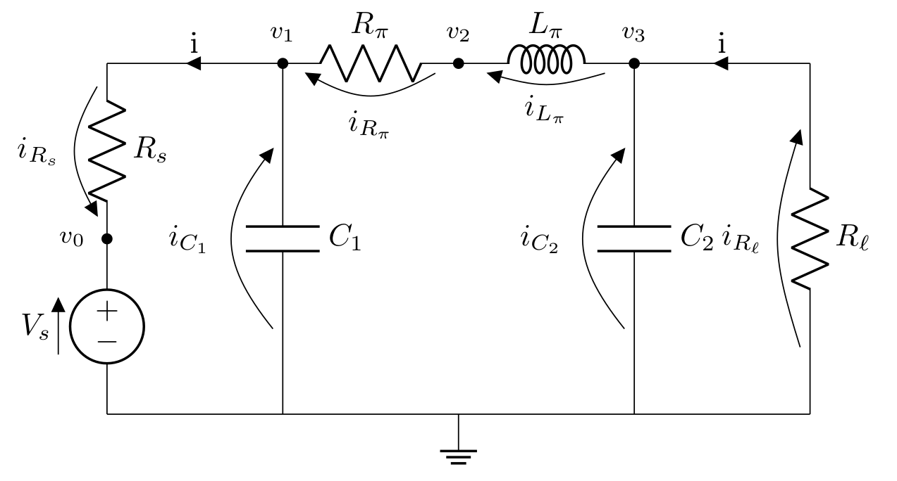

# Tutorial

## 1. Components of a DC Microgrid
In this first chapter of the tutorial, the DC microgrid will be explained and ordinary differential equations (ODE) for each component will be derived for a simulation. In order to understand how a DC microgrid works, we take a look to their construction. The main components are a _DC/DC converter_ and the _Pi-model transmission line_ (shortly: _Pi-model line_). 

### 1.1 Pi-model transmission line

  

The Pi-model line serves as a connection between each power component in the microgrid. The circuit describing the Pi-model line can be seen above and consists of two capacitors, two resistors and an inductor. Here, a voltage source is also added. Later, this circuit is connected to other ODEs describing _DC/DC converters_ and source of voltage will be provided by a battery.

### 1.2 Step-down (buck) converter

  

The figure above shows a simplification of a buck (step-down) converter. The buck converter converts a large input voltage in a smaller output voltage. To do this, the switches will be operated in opposite states. The output voltage is always compared to a target output voltage. When both voltages are equal, then switches will be switch over.
